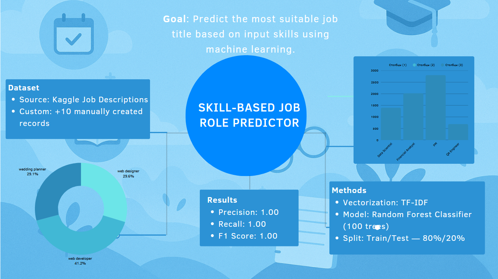
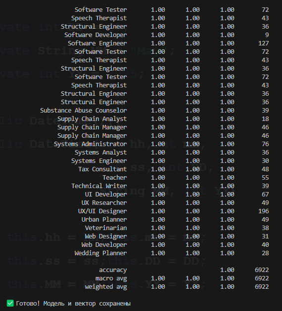

# Skill-Based Job Role Predictor

This project aims to predict a relevant **job role** based on a given list of **skills**, using supervised Machine Learning techniques
---

## Preview



---



---

## Dataset

- **Primary Dataset**:  
  Kaggle – Job Descriptions Dataset (~30,000 rows)  
  Columns used: `skills`, `Job Title`

- **Custom Data (Required +10%)**:  
  Added 10 hand-crafted records to a separate CSV file `my_custom_data.csv`

- **Merged Data**:  
  Final dataset: `combined_dataset.csv` (via `merge_datasets.py`)

---

## Technologies Used

- Language: Python 3.13
- Environment: Python scripting + venv
- Libraries:  
  - `pandas`  
  - `scikit-learn`  
  - `joblib`  

---

## Model

- Vectorization: `TfidfVectorizer(max_features=1000)`
- Classifier: `RandomForestClassifier(n_estimators=100)`
- Split: `train_test_split(test_size=0.2)`
- Evaluation: `classification_report()`

Metrics (on test set):
```
Accuracy: 1.00  
Precision: 1.00  
Recall: 1.00  
F1 Score: 1.00
```

---

## Folder Structure

```
Skill-Based Job Role Predictor/
├── job_role_predictor.py
├── merge_datasets.py
├── job_descriptions.csv
├── my_custom_data.csv
├── combined_dataset.csv
├── job_predictor_model.joblib
├── vectorizer.joblib
├── Skill-Based_Job_Role_Predictor_Report_Final.pdf
├── poster.pdf
├── video_link.txt
├── README.md
```


## Instructions to Run

```bash
# Create and activate virtual environment
python3 -m venv venv
source venv/bin/activate

# Install requirements
pip install pandas scikit-learn joblib

# Run
python3 job_role_predictor.py
```
